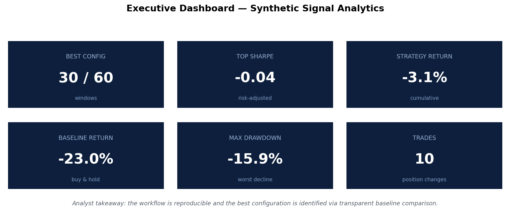
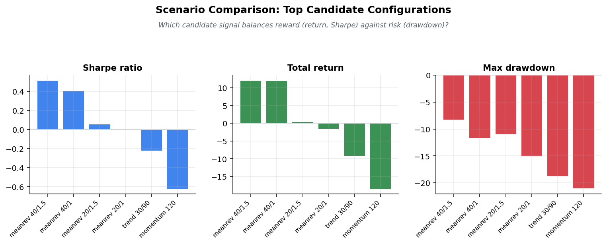
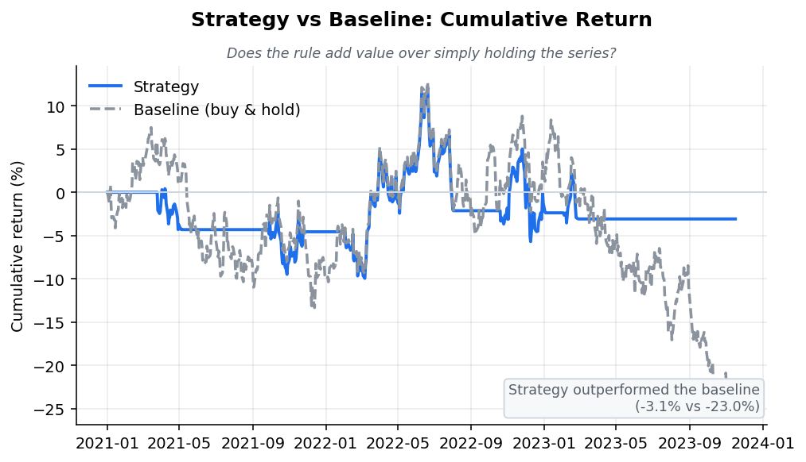
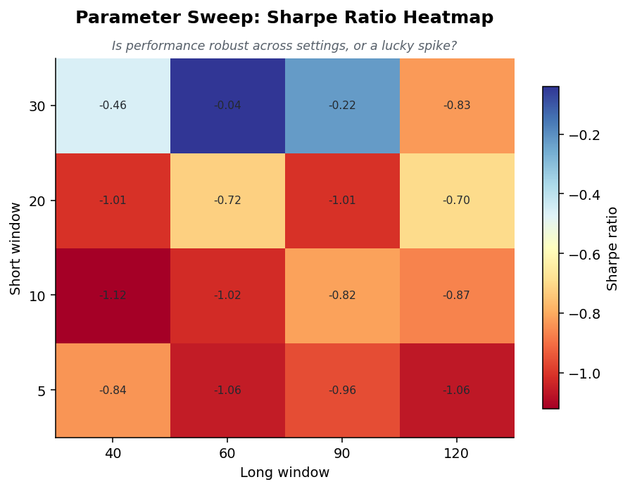
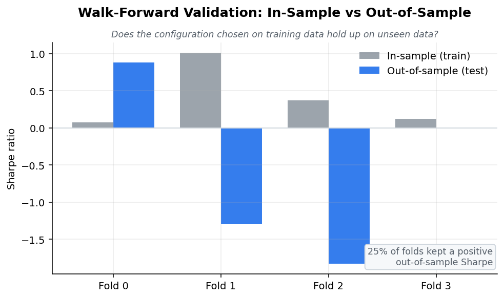
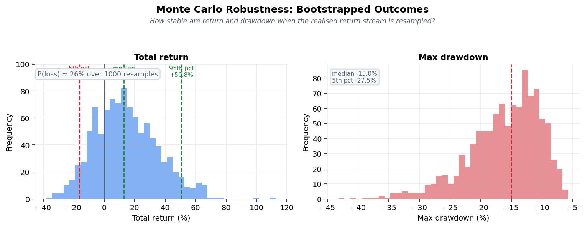
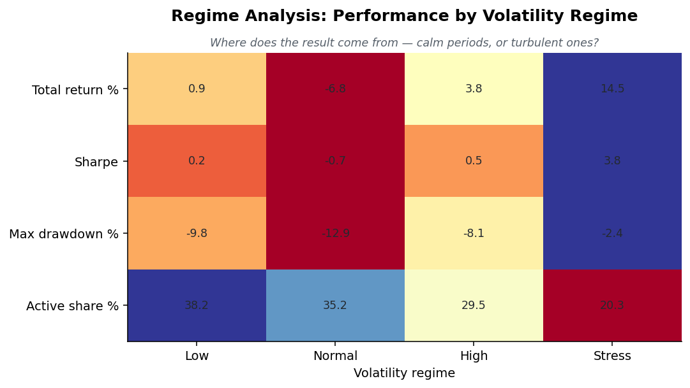
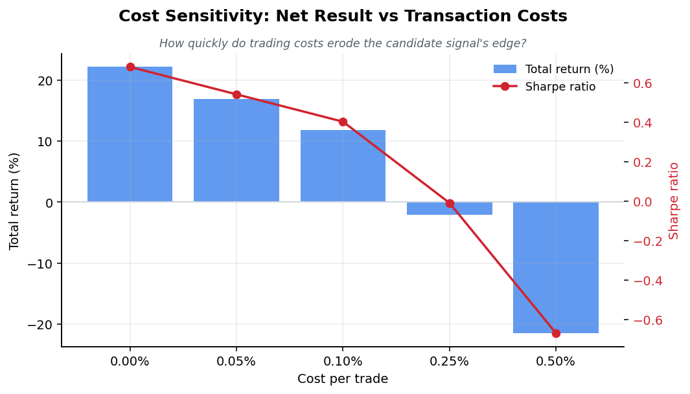

# NeuroQuantAI — Synthetic Quant Research & Analytics Lab

[](https://github.com/AlanBuildsAI/NeuroQuantAI-Institutional-Backtesting-Lab/actions/workflows/tests.yml)

NeuroQuantAI is a synthetic quant research and analytics lab for evaluating
candidate signals with feature engineering, multiple signal families,
in/out-of-sample testing, walk-forward validation, Monte Carlo robustness,
regime-aware diagnostics, cost-sensitivity and stress analysis, KPI reporting,
and self-contained dashboarding.

> **Disclaimer.** This is a research and analytics **demonstration**. It runs
> on **synthetic data by default**; optional local CSV research data can be
> supplied by the user. It is **not** financial advice, **not** an investment
> recommendation, **not** a live-trading system, and makes **no performance
> guarantees**. There are **no live data feeds, no APIs, and no brokerage
> connections** anywhere in this repository.

---

## What this is

A serious, end-to-end demonstration of how credible quant research is done —
applied to a neutral *synthetic signal series* so the focus stays on
**methodology, not market calls**. The candidate signals are deliberately
simple and explainable; the value is the disciplined workflow around them:
engineered features, several signal families compared fairly against a
baseline, parameters chosen **in-sample** and judged **out-of-sample**,
walk-forward folds, Monte Carlo robustness, regime attribution, cost
sensitivity, stress diagnostics, a documented KPI scorecard, and a one-page
dashboard a reviewer can read in minutes.

"Backtesting" here is used as a **controlled research experiment** for measuring
and comparing signals under honest assumptions — not as trading advice or a
deployment-ready system.



---

## Research workflow

```
data generation / optional CSV load
        ↓
   validation gates
        ↓
   feature engineering
        ↓
in-sample selection across signal families  →  candidate configuration
        ↓
train / test split  →  out-of-sample evaluation
        ↓
   walk-forward validation
        ↓
  Monte Carlo robustness
        ↓
regime attribution  ·  cost sensitivity  ·  stress tests
        ↓
KPI scorecard  →  visuals  →  self-contained HTML report
```

Parameters are selected on the in-sample period only and judged on a held-out
out-of-sample period, so headline numbers are not the product of fitting and
scoring on the same data.

---

## Signal families

All families are long-or-flat (position in `{0, 1}`), shifted one bar before
trading to avoid look-ahead bias, and defined in
[`src/neuroquant/signals.py`](src/neuroquant/signals.py):

- **Trend** — moving-average crossover (long when fast MA > slow MA).
- **Momentum** — long when trailing momentum over a look-back is positive.
- **Mean reversion** — long when the price z-score is oversold (below a
  negative threshold).
- **Composite** — averages the three signals above into a transparent 0–1 score
  and goes long when at least half agree. (This is a literal composite of real
  signals — there is no machine-learning model in this repo.)
- **Volatility filter** *(optional)* — damps exposure when rolling volatility
  exceeds a **trailing** (expanding-quantile) threshold, so the filter never
  uses future data.

The in-sample selection and walk-forward both choose among these families.

---

## Feature engineering

[`src/neuroquant/features.py`](src/neuroquant/features.py) builds small,
explainable, **causal** features (no forward shifts): one-bar and log returns,
moving averages and price-to-MA distance, multi-horizon momentum, rolling
z-scores, rolling volatility, drawdown-from-rolling-high, and volatility
**regime labels** (low / normal / high / stress). A sample feature frame is
exported to `sample_outputs/feature_sample.csv`.

---

## Robustness & diagnostics

- **In/out-of-sample split** — selection isolated from evaluation.
- **Walk-forward validation** — rolling folds re-select across families on each
  training window and score on the next unseen window.
- **Monte Carlo robustness** — bootstrapped resamples of the realised return
  stream describe the spread of total return and drawdown and the probability
  of a losing path (robustness analysis, not a forecast).
- **Regime attribution** — performance broken down by volatility regime.
- **Cost sensitivity** — the selected rule re-run across a ladder of
  transaction-cost assumptions (0.00%–0.50%).
- **Stress diagnostics** — labelled synthetic transforms (higher costs,
  volatility shock, adverse drift, amplified downside).

---

## Visual overview

| Visual | What it answers |
| --- | --- |
|  | **Executive dashboard** — selected configuration, KPI scorecard, and analyst takeaway at a glance. |
|  | **Scenario comparison** — top candidate configurations across return, risk-adjusted score, and downside. |
|  | **Baseline comparison** — does the candidate signal add information versus simply holding the series? |
|  | **Parameter sweep** — how the trend-family outcome changes across the window grid. |
|  | **Walk-forward validation** — does the in-sample choice survive out-of-sample? |
|  | **Monte Carlo robustness** — how stable are return and drawdown when returns are resampled? |
|  | **Regime analysis** — where does the result come from: calm periods or turbulent ones? |
|  | **Cost sensitivity** — how quickly do trading costs erode the edge? |

---

## Why results may be weak or negative

The goal is **not** to cherry-pick a winning backtest. It is to test a
hypothesis honestly. On synthetic data a simple rule will frequently fail to
beat its baseline — and that is a perfectly good result. A weak or negative
finding is valuable when it is **reproducible, fairly measured, and clearly
communicated**, because in real research "the evidence does not support the
hypothesis" is often the most useful conclusion you can deliver.

---

## How to run

Using the bundled virtualenv (`.venv`) and the Makefile:

```bash
make install   # install pandas, numpy, matplotlib, pytest
make run        # run the full pipeline -> charts, CSVs, HTML dashboard
make report    # alias for run (regenerates all deliverables)
make test       # run the pytest suite
make clean      # remove generated artefacts
```

Equivalent raw commands (no Make required):

```bash
.venv/bin/pip install -r requirements.txt
PYTHONPATH=src .venv/bin/python -m neuroquant.pipeline   # full run
.venv/bin/python examples/minimal_backtest.py            # tiny demo, no files written
.venv/bin/python -m pytest tests/ -q                     # tests
```

Optional editable install (then drop the `PYTHONPATH=src` prefix):

```bash
.venv/bin/pip install -e .
```

---

## Optional local CSV input

The default pipeline uses synthetic data and needs no files. To run the same
research over your own **local** historical data (offline; no network, no API):

```python
from neuroquant.data import load_csv_series
frame = load_csv_series("my_series.csv")  # needs a date/timestamp + close column
```

The loader validates sorted, de-duplicated timestamps and a clean, positive
`close` column. `open`, `high`, `low`, `volume` are kept if present.

---

## Interactive demo

The project offers two complementary demo layers:

- **GitHub Pages — polished static report.** The self-contained dashboard is
  published as a static page by the
  [`Deploy dashboard to Pages`](.github/workflows/pages.yml) workflow after tests
  pass. It is a single offline HTML file (no external scripts or CDNs).
  - **Dashboard URL:** `https://AlanBuildsAI.github.io/NeuroQuantAI-Institutional-Backtesting-Lab/`
    *(enable Pages once: repo Settings → Pages → Source: “GitHub Actions”).*

- **Streamlit — interactive research demo.** [`streamlit_app.py`](streamlit_app.py)
  lets a visitor generate synthetic data (or upload a local CSV for the session),
  choose a signal family and parameters, and run the same validation,
  walk-forward, Monte Carlo, regime, cost-sensitivity and stress diagnostics
  live. It performs no network calls and never persists uploaded data.
  - **Interactive demo URL:** coming soon

Run the interactive demo locally:

```bash
.venv/bin/pip install -r requirements.txt
streamlit run streamlit_app.py
```

### Deploy on Streamlit Community Cloud

1. Go to [Streamlit Community Cloud](https://streamlit.io/cloud).
2. Connect this GitHub repository.
3. Select branch `main`.
4. Set the app file to `streamlit_app.py`.
5. Python dependencies are installed from `requirements.txt`.
6. Click **Deploy**.

---

## Outputs

Charts in `docs/assets/` (PNG + SVG):

| File | What it is |
| --- | --- |
| `dashboard_snapshot` | Executive KPI-card snapshot |
| `equity_curve` | Strategy vs baseline cumulative return |
| `drawdown` | Drawdown (risk) profile |
| `scenario_comparison` | Top candidate configs across return / Sharpe / drawdown |
| `sweep_heatmap` | Sharpe across the trend window grid |
| `return_distribution` | Daily return histogram |
| `walk_forward` | In-sample vs out-of-sample Sharpe by fold |
| `monte_carlo` | Bootstrapped return & drawdown distributions |
| `regime_heatmap` | KPIs by volatility regime |
| `cost_sensitivity` | Net result vs transaction-cost ladder |

Reports in `sample_outputs/`:

| File | What it is |
| --- | --- |
| `dashboard.html` | Self-contained one-page report (opens offline) |
| `parameter_sweep_summary.csv` | Multi-family scenario comparison table |
| `equity_curve_sample.csv` | Per-day equity curve of the selected config |
| `walk_forward_summary.csv` | Per-fold walk-forward results |
| `regime_summary.csv` | Performance by volatility regime |
| `cost_sensitivity.csv` | KPIs across the transaction-cost ladder |
| `stress_test_summary.csv` | KPIs under stress transforms |
| `feature_sample.csv` | Engineered feature frame |

---

## Limitations

- Synthetic data by default; it has no real-world structure and results do not
  generalise to any market.
- A small set of deliberately simple, explainable signal families; long-or-flat
  positions only (no shorting, no leverage, no position sizing).
- Composite is a transparent score of simple signals — **not** a machine-learning
  model.
- No live trading, no order routing, and no execution modelling beyond a
  simplified flat cost / slippage assumption.
- Regime labels for *attribution* use full-series volatility quantiles
  (descriptive); the tradeable volatility *filter* uses a trailing threshold.
- Not investment advice and not production trading infrastructure.

---

## Future work

- Additional signal families and richer feature engineering.
- More realistic transaction-cost and slippage modelling.
- Portfolio-level (multi-series) testing.
- First-class bundled local CSV research datasets.
- Richer report export options.

---

## Why this matters across analytics roles

The same workflow — validate inputs, engineer features, design a fair
experiment, separate selection from evaluation, test robustness, measure risk
as well as return, and communicate the evidence — transfers directly to **data
analytics**, **business analytics**, **operations analytics**, **product
analytics**, **healthcare operations analytics**, and **quant analytics**. The
differentiator is not a clever model; it is a trustworthy, reproducible,
well-communicated process.

Further reading: [`docs/methodology.md`](docs/methodology.md),
[`docs/analytics_explanation.md`](docs/analytics_explanation.md),
[`docs/portfolio_relevance.md`](docs/portfolio_relevance.md).
