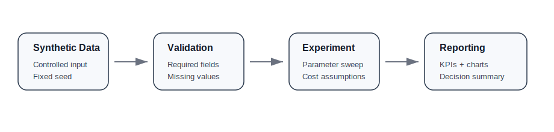
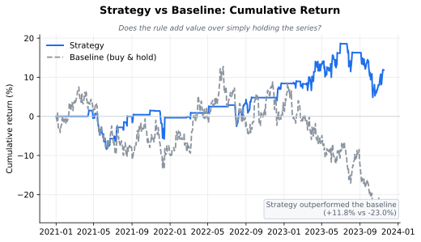
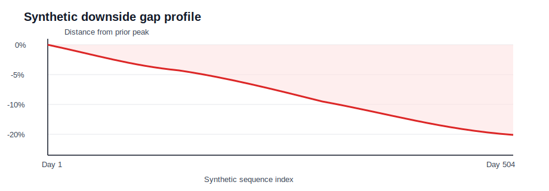

# NeuroQuantAI Institutional Backtesting Lab

A portfolio-oriented **Python analytics case study** focused on disciplined experiment design, data validation, KPI reporting, and clear communication.

> Synthetic data only. Educational / portfolio project. Not financial advice, not trading signals, and not intended for live deployment.

## Portfolio summary

NeuroQuantAI demonstrates how an analyst turns a messy research question into a reproducible workflow:

```text
synthetic input data → validation checks → experiment logic → parameter sweep → KPI table → visual summary → interpretation
```



The purpose is not to claim a winning system. The purpose is to show **analytics discipline**: controlled inputs, assumptions, data quality checks, baseline comparison, metric design, and decision-ready reporting.

## Visual outputs

| Model output vs baseline | Downside gap profile |
|---|---|
|  |  |

## Current working example

Run the reproducible synthetic example:

```bash
pip install -r requirements.txt
python examples/minimal_backtest.py
```

The script now exports:

```text
sample_outputs/parameter_sweep_summary.csv
docs/assets/equity_curve.svg
docs/assets/drawdown_profile.svg
```

## What the script does

- Generates reproducible synthetic daily data using a fixed seed
- Runs data quality checks before analysis
- Compares multiple parameter configurations
- Applies implementation-cost and slippage assumptions
- Compares output against a baseline curve
- Calculates KPI-style metrics: total result, baseline result, volatility, Sharpe ratio, Sortino ratio, max downside gap, active days, change count, and baseline correlation
- Exports a structured CSV summary and chart assets for presentation

## Example output

```text
Synthetic backtest parameter sweep
 short_window  long_window  total_return_pct  benchmark_return_pct  annualized_volatility_pct  sharpe_ratio  sortino_ratio  max_drawdown_pct  active_days  trade_count  market_correlation
           20           60            -13.31                  3.55                      14.38         -0.42          -0.44            -20.42          235           11                0.67
            5           20            -15.64                  3.55                      14.71         -0.50          -0.59            -24.00          244           32                0.69
           10           30            -18.65                  3.55                      14.30         -0.65          -0.70            -24.67          233           21                0.67
```

Negative results are intentionally acceptable. A credible analytics workflow should measure results honestly instead of selecting only flattering scenarios.

## Why this is analytics

This project is useful for a data analyst portfolio because it demonstrates:

- Python analytical workflows with pandas and NumPy
- Data validation before calculation
- Reproducible synthetic-data experiments
- Parameter comparison and experiment tracking
- KPI design and structured summary tables
- Baseline comparison
- Visual reporting
- Clear documentation for non-technical reviewers
- Translating raw outputs into decision-ready summaries

See: [`docs/analytics_explanation.md`](docs/analytics_explanation.md)

## Repository structure

```text
examples/
  minimal_backtest.py            # reproducible synthetic analytics workflow
docs/
  analytics_explanation.md       # explains why this belongs in an analytics portfolio
  methodology.md                 # workflow explanation and limitations
  assets/
    analytics_workflow.svg
    equity_curve.svg
    drawdown_profile.svg
sample_outputs/
  parameter_sweep_summary.csv
requirements.txt
README.md
```

## Methodology summary

1. Generate synthetic input data.
2. Validate required fields and basic data quality.
3. Create experiment signals.
4. Shift positions by one period to avoid look-ahead bias.
5. Apply cost and slippage assumptions.
6. Calculate output curve, baseline curve, downside profile, and KPI metrics.
7. Compare multiple configurations in a structured table.
8. Export CSV and visual assets.

## Limitations

This repository intentionally avoids live data, brokerage APIs, execution systems, and performance claims. It should be evaluated as a portfolio example of analytical workflow design rather than investment performance.

## Next improvements

- Add a notebook-style walkthrough
- Add a small dashboard-ready HTML report
- Add more scenario tests
- Add walk-forward validation example
- Add Monte Carlo robustness example
